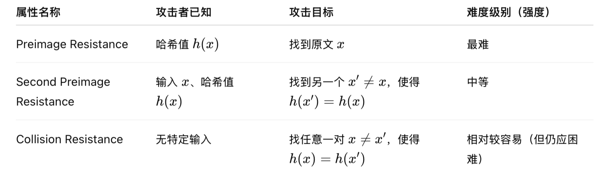

# lec15: Crypto

[toc]

## Concepts of Cryptology

- **Cryptography**: The **sending and receiving** of secret message
- **Cryptanalysis**: The **interception and analysis** of secret messages
- **Cryptology**: All of the above

## Hash Function Properties

- **Compression**
    - No matter how long the input is, the output has the same length

- **Ease of computability**
    - Given x, it should be easy to find h(x)

- **Collision Avoidance**
    - It should be “computationally infeasible” to find collisions

- **Preimage Resistance**
    - Given y, it should be “computationally infeasible” to find x to satisfy:
- **Second Preimage Resistance**
    - (weak collision resistance) 
    - Given x and h(x), it should be “computationally infeasible” to find x’ to satisfy
- **Collision Resistance**
    - (strong collision resistance) 
    - It should be “computationally infeasible” to find any x and x’ that satisfy:

## Math Fundamentals

- **Congruence**

- **Discrete Logarithms**
    - much harder to compute

## Encryption

- **Encryption**: We encode a message such that only authorised users may read it 
- **Cipher**: takes a string of plaintext, and converts it into a string of ciphertext
    - **Symmetric** – same key for encryption / decryption 
    - **Asymmetric** – separate keys

**Cipher Types**

- **Primitive Types**
    - **Stream Ciphers**: Operate on a stream of input data
    
    - **Block Ciphers**: Operate on a fixed sized block
    
    - **Hash Functions**: Take data of any size and output a block of fixed size
    
- **The Caesar Cipher**
    - Vulnerable to frequency analysis

- The Vigenere Cipher

**XOR**

**The One-Time Pad**

- Use a key that is the **same length as the message**
- The one-time pad is the only example of perfect secrecy
- What the one-time pad gives us in secrecy, it lacks in:
    - **Portability** – the key has the same size as the message 
    - **Convenience** – you must never reuse a key

> **Kerckhoff's Principle**
>
> “A cryptographic system must be secure even if everything is known about the system with the exception of the secret key”

## Block Ciphers

**Block Ciphers**

- Block ciphers use a key to encrypt a **fixedsize block** of plaintext into a **fixed-size block of ciphertext** 
- They are usually more **computationally expensive** than stream ciphers, but have numerous benefits 
- If you’re careful, you can convert between block and stream ciphers using modes of operation
- If we change one bit of plaintext in a traditional cipher, one bit of output will change
    - Vulnerable to known and chosen plaintext attacks
- Modern block ciphers are designed to **diffuse changes throughout each block**

**SP-Networks**

- Claude Shannon suggested that all that was required for a strong cipher was repeated **substitution** and **permutation** 
- SP-Networks combine a substitution process with a permutation into a single round 
- Rounds are then repeated enough times to ensure the algorithm is secure

### Data Encryption Standard (DES)

- **It is a 64-bit blocklength with a 56-bit key**
- 16 round **Feistel cipher**

### Advanced Encryption Standard (AES)

- Superseded DES as a standard in 2002 
- A standard built around the **Rijndael algorithm** 
- Rijndael is an SP-Network with a **128-bit block size, and a key length of 128**, 192 or 256-bits 
- Round count depends on key length

## Block Cipher Modes

- Most messages aren’t in convenient 128-blocks
- Run a block cipher repeatedly on consecutive blocks
- **Electronic Code Book (ECB)**
    - encrypt each block one after another
- **Cipher Block Chaining (CBC)**
    - XOR the output of each cipher block with the next input
- **Counter Mode (CTR)**
    - Encrypting a counter to produce a stream cipher
- **Galois Counter Mode (GCM)**
    - Extension of CTR

## Public Key (Asymmetric) Cryptography

- Two keys, **a public key** and **a private key**
- Public-key cryptography gains us a few important abilities:
    - We can exchange a private symmetric key “in the open” 
    - We can verify the sender of a message 
    - Non-repudiation – you can’t deny you did something

## Diffie-Hellman

- **Procedures**

- **Why is DH KEX Secure**

**Vulnerabilities**

- A third party could intercept the initial communication from Alice, then create two separate key exchanges with both Alice and Bob 
- Simply re-encrypting each message would allow them to sit in the middle of the conversation 
- We can avoid this by combining DH with another cryptographic protocol

**Perfect forward secrecy**

- **we generate new keys for each session, rather than persistent keys**

**Ephemeral Mode**

- In protocols like TLS, running DiffieHellman in ephemeral mode **forces a new key exchange every time** 
- The recommended settings for TLS are now 2048-bit DH keys, in ephemeral mode

## RSA

- **Two use cases for RSA**
    - **Encryption** only the owner can read 
    - **Signing** that must have been performed by the owner

## Digital Signatures

- Authentication codes provide integrity, but don’t guarantee the sender 

- **Public-key encryption** allows us to sign documents

- Majority of modern protocols use:

    - **The Digital Signature Algorithm (DSA)**

        Based on large exponents in modulus arithmetic, much like Diffie-Hellman

    - **RSA Signing**

        A variant of RSA, based on the problem of factoring large composite primes

### Digital Certificates

- We can use a trusted third party (TTP) in order to verify the ownership of a public key 
- Server produces a certificate containing its public key, which wants to be trusted
- The certificate goes to a **certificate authority (CA)**, who, after doing ID checks, signs the certificate with CA’s private key
- Client wants to use the server, who sends client something (e.g., DHKEX parameters) signed with its private key
- Server sends client a certificate, which has been signed by a CA for verification
- Client has the CA public key stored in the browser. Client trusts the browser, so client trusts the CA. Client uses the CA public key to verify the certificate.
- When the certificate is verified, it is trusted, and the public key is used to verify the object

> **服务器生成证书**：服务器生成一个包含自己公钥的证书，并希望客户端信任它。
>
> **提交给CA**：服务器将这个证书提交给**证书颁发机构（CA）**，CA会验证服务器的身份，并用**CA的私钥**对证书进行签名，表示这个证书是可信的。
>
> **服务器发证书给客户端**：当客户端想与服务器通信时，服务器会发送这个已被CA签名的证书。
>
> **客户端验证证书**：客户端通过浏览器存储的**CA公钥**来验证服务器证书的有效性。如果证书有效，客户端就信任这个服务器的公钥。
>
> **建立信任**：验证通过后，客户端就可以信任服务器的公钥，进行安全的数据交换。

