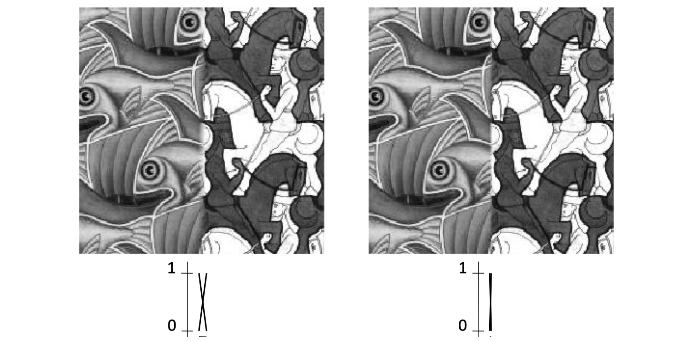

# lec05: Image Stitching 2

[toc]

## Image (parametric) Warping

- Change every pixel locations to create a new image (global)
- Examples of parametric warps:

- Given a coordinate transform $x' = h(x)$ and a source image $f(x)$,
- We compute a transformed image $g(x') = f(h(x))$
    - Change the domain of image function

- **Image filtering**: change **range** of image
- **Image warping**: change **domain** of image

- How do we specify where every pixel goes?
    - Describe the destination pixel for every source, and vice-versa
    - **Mapping**
- How do we compute colors at dest pixels?
    - **Resampling**

### Forward Warping

- Send each pixel $f(x)$ --**the RGB value**-- to its corresponding location in the dest image: $x’ = h(x)$ in $g(x’)$.
- What if pixel lands “between” two pixels?
    - Answer: **add “contribution”** to several neighboring pixels, normalize later (splatting).

> 如果某个像素被映射到目标图像中的位置刚好落在两个像素之间（即不是精确的像素位置），那么这个像素的值将不会直接映射到一个单一的像素点，而是会通过**"splitting"（溅射）**技术分配到多个邻近的像素上

### Inverse Warping

- Get each pixel $g(x’)$ --**the RGB value**-- from its corresponding location in the source image: $x = h^{-1}(x’)$ in $f(x)$.
- What if pixel comes from “between” two pixels?
    - Answer: resample color value from **interpolated** source image.

> **插值**：如果映射后的像素位置位于两个像素之间，必须使用插值方法（例如双线性插值）来计算该位置的颜色值。这种方法通过考虑邻近像素的颜色值和其相对位置来确定新像素的颜色值。

### Bilinear Interpolation

**Possible interpolation filters**

- Nearest neighbour
- **Bilinear**

## Image Blending 图像混合

**Effect of window size**

### Alpha Blending

- **Implement this in two steps:**
    - **accumulate**: add up the (α premultiplied) RGB values at each pixel.
    - **normalize**: divide each pixel’s accumulated RGB by its α value.

### Pyramid Blending

**Forming a Gaussian Pyramid**

- Start with the original image `G0`.
- Perform a Gaussian filtering about each pixel, **down sampling** so that the result is a reduced image of half the size in each dimension.
- Do this all the way up the pyramid.

> **原始图像（Base Level）**：最底层（即金字塔的第一层）就是原始图像。它包含了图像的所有细节信息。
>
> **高斯模糊（Gaussian Blur）**：对原始图像应用高斯滤波，模糊图像的细节，平滑图像。高斯模糊能够降低图像的高频信息（如边缘和噪声），保留低频信息（如图像的整体形状和大尺度结构）。
>
> **降采样（Downsampling）**：在模糊之后，通过降采样操作（通常是每两个像素取一个），减少图像的尺寸，得到一个较低分辨率的图像。降采样的操作可以是对图像进行奇偶行列的选择，或是将图像大小缩小一半。
>
> **重复操作（Recursive Steps）**：对于降采样后的图像，重复应用高斯模糊和降采样步骤，直到得到最小分辨率的图像层。每一层都是上一层图像经过高斯模糊和降采样得到的。

**Making the Laplacians**

- We want to subtract each level of the pyramid from the next lower one.
- But they are different sizes!
- In order to do the subtraction, we perform an **interpolation process.**
- We interpolate new samples between those of a given image to make it big enough to subtract.
- The operation is called **EXPAND**.

**Forming the New Pyramid**

- Laplacian pyramids LA and LB are constructed for images A and B, respectively.
- A third Laplacian pyramid LS is constructed by copying nodes from **the left half** of LA to the corresponding nodes of LS and nodes from **the right half** of LB to the right half of LS.
- Nodes along the center line are set equal to **the average** of corresponding LA and LB nodes

### Multiband Blending

- Decompose the image into multi-band frequency
- Blend each band appropriatelyAt low frequencies, blend slowly
    - Image regions that are “smooth”
- At high frequencies, blend quickly
    - Image regions have a lot of pixel intensity variation

**Gain compensation: Getting Rid of Artifacts**

- **Simple gain adjustment**
    - Compute **average RGB intensity** of each image in **overlapping region**
    - **Normalize intensities by ratio of averages**

## Recognizing Panoramas

**Input: N Image**

- Extract SIFT **points, descriptors** from all images

- Find **K-nearest neighbors** for each point (K=4)
- For **each image**
    - Select M candidate matching images by counting matched keypoints (M=6)
    - Solve homography `H_ij` for each matched image
    - Decide if match is valid
- Find connected components of the graph
- For **each connected component**
    - Solve for rotation and f (camera parameters)
    - Project to a surface (plane, cylinder, or sphere)
    - Render with multiband blending
