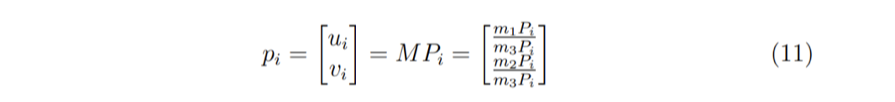
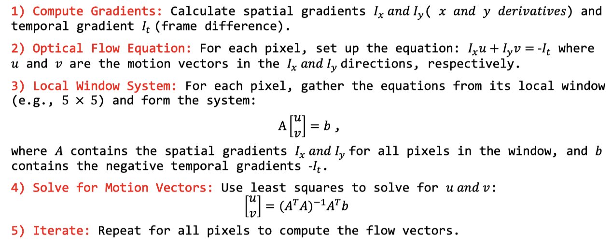
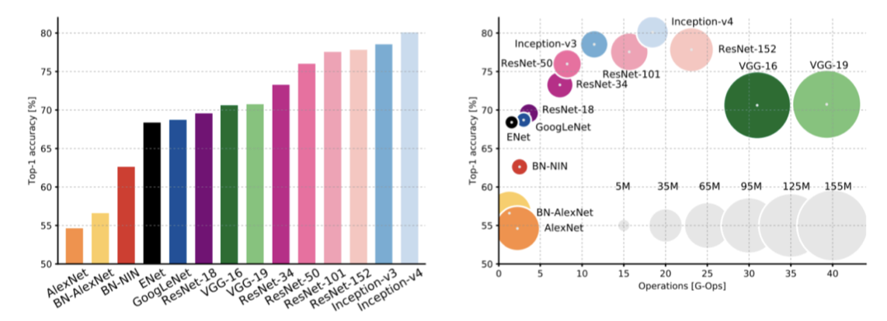

# Revision

[toc]

## Feature Detection and Stitching

### Image Feature Descriptor

> **Image features** are **distinctive characteristics extracted from an image** that help algorithms recognize and analyze objects, textures, and structures.

- **Common features** used in CV (**CEST**):
    - Colour
    - Edge
    - **Texture**: **the frequency** with which **patterns of colour**/grey level 
    - **Shape**: describes the outline, boundary, or structure of objects
- Some common **feature vectors**
    - Colour histograms
    - Local binary patterns
    - Histograms of Gradient Orientations (HoG)

**Color Features**

- Colour is a property of a single pixel
- Colour correlates well with class identity.
- **Histograms Properties**
    - Are invariant to **translation** and **rotation**
    - Change slowly with **viewing direction** and **object size**

**Local Binary Patterns (LBP)**

- **Divide the patch into cells** e.g. 16 x 16 pixels per cell.
- Compute the **local patch description number** of each pixel.
    - 下图中，中心pixel对应的值就是二进制的`11111100`即`252`
- **Histogram** these numbers over each cell.
    - Usually a 256-d feature vector.
- Optionally **normalize** each histogram (so its bins sum to 1).
- **Concatenate** (normalized) histograms to **make the feature vector.**
    - 假设图像被划分成 10×10 个 cell，最终的向量维度就是`10*10*256`

**Shape Features**

- Focus on **image gradient** measures:
    - The gradient of an image measures **how it is changing**.
    - The **boundaries of objects** are often associated with **large gradients**.
    - Distributions of gradients and gradient orientations reflect boundary shape (and internal boundaries between parts, surfaces, etc.).

> **Examples of Gradient Magnitude and Orientation**
>
>   [  10   20   30  ]
>   [  20   50   80  ]
>   [  40   70  100  ]
>
> - $G_x = 80 - 20 = 60, \quad G_y = 70 - 20=50$
> - $\mathrm{Magnitude} = \sqrt{G_x^2 + G_y^2} = 78.1$
> - $\mathrm{Orientation} = \arctan(G_y/G_x) = 39.8^\circ$

**Derivative Filters**

- Sobel Operators

**Histogram of Oriented Gradients (HoG)**

- **Basic idea:**
    - Local shape information often well described by the distribution of **intensity gradients** or **edge directions**
    - Convert the **image into a feature vector**, then apply the **classification** algorithms
    - To **generalize the object** such that the **same object produces similar feature descriptor** when viewed **under different conditions**
- **Main Steps**
    - Divide the patch into small **cells** and define slightly larger **blocks**
    - Compute **gradient magnitude and orientation** at each pixel.
    - Compute **a local weighted histogram** of gradient orientations for each cell, weighting by some function of magnitude.
        - 每个cell默认是9维直方图，代表0-180度
    - **Concatenate histogram** entries to form a HoG vector for each block.
    - **Normalize vector values** by dividing by some function of vector length.

### Scale Invariant Feature Transform (SIFT)

> **SIFT** is an algorithm that detects and **describes distinctive keypoints** in an image that are robust to changes in scale, rotation, and lighting.

**The Method (SKOK)**

- **Scale-space extrema detection (for scale invariance)**
    - Search over all scales to**detect points that are invariant to scale and orientation**
- **Keypoint localization (for translation invariance)**
    - Select keypoints based on **measures of their stability**
- **Orientation assignment (for rotation/orientation invariance)**
    - Compute best orientation for each keypoint region
- **Keypoint descriptor (for illumination invariance)**
    - Use local image gradients at selected scale and rotation for each keypoint region

**Invariance Properties**

- To be robust to intensity value changes	
    - Use gradient orientations
- To be scale invariant
    - Estimate the scale using scale space extrema detection
    - Calculate the gradient after Gaussian smoothing with this scale
- To be orientation invariant
    - Rotate the gradient orientations using the dominant orientation in a neighborhood
- To be Illumination invariant
    - Working in gradient space, so robust to I = I + b
    - Normalize vector to [0…1], robust to I = αI brightness changes
    - Clamp all vector values > 0.2 to 0.2, robust to “non-linear illumination effects”

### Random Sample Consensus (RANSAC)

- **RANSAC loop for estimating homography:**
    - Select four feature pairs (at random)
    - Compute homography H (exact) and inliers where $\|p_i', Hp_i \| < \epsilon$
    - Keep the **largest set** of inliers
    - Re-compute **least-squares H** estimate using all of the inliers

### Image Stitching

**The Idea**: compute transformation -> warp to overlap -> blend -> repeat

- Take a sequence of images **from the same position**.
- **Compute transformation** between second image and first.
- Shift (**warp**) the second image to **overlap** with the first.
- **Blend** the two together to create a mosaic.
- If there are more images, repeat step 2 to 4.

**Finding the Transformation**

- Translation = 2 degrees of freedom
- Similarity = 4 degrees of freedom
- Affine = 6 degrees of freedom
- Projective (Homography) = 8 degrees of freedom

**Image Warping**

- Move pixels of an image
- Given a coordinate transform $x'=h(x)$ and a source image $f(x)$,
    - We compute a transformed image $g(x') = f(h(x))$
    - Change the domain of image function
- **Forward Warping**: for each pixel in f(x), find its corresponding pixel in g(x’) where x’=h(x)
- **Inverse Warping**: for each pixel in g(x’), find its source pixel in f(x) where x=h-1(x’)

| 类型                | 操作方向  | 适合插值 | 是否有空洞 | 实际应用 |
| ------------------- | --------- | -------- | ---------- | -------- |
| **Forward Warping** | 源 → 目标 | 较差     | 可能有空洞 | 少用     |
| **Inverse Warping** | 目标 ← 源 | 很好     | 不易有空洞 | 常用     |

**Image Blending**

- Feathering
- Alpha Blending
- Pyramid Blending
- Multiband Blending
    - Compute Laplacian pyramid of images and mask.
    - Create blended image at each level of pyramid.
    - Reconstruct complete image.

## Multiple Views and Motion

### Camera Modeling

> **Camera Modeling**: A formal construction of the **pinhole camera model** s

**Essential Components:**

- The film is commonly called the image or retinal plane:
    - The 2D plane where the projection of the 3D scene is captured, forming the image.
- The **aperture** is referred to as the **pinhole O** or center of the camera.
    - The point through which all light rays from the 3D scene pass.
- The **focal length f**: The distance between the image plane and the pinhole O.

**Camera Modeling**

### Camera Matrix Model and Homogeneous Coordinates

**Camera Matrix Model**

- **Camera Matrix Model**: describes a set of important parameters that affect how **a world point P is mapped to image coordinates P'**.
- **Intrinsic parameters** define the **internal characteristics** of the camera
    - Maps the camera's coordinate system to the image coordinate system
    - e.g.: focal length $f_x, f_y$, principal point $c_x, c_y$ (the intersection of the **optical axis** with the **image plane**),  and skew $s$ (if the image axes are not perpendicular).

$$
K =
\begin{bmatrix}
f_x & s & c_x\\
0 & f_y & c_y\\
0 & 0   & 1\\
\end{bmatrix}
$$

- **Extrinsic parameters** describe the **position and orientation** of the camera in the world coordinate system
    - Maps  the world coordinate system to the camera's coordinate system
    - This transformation is captured by a rotation matrix $R$ and translation vector $T$.

- Overall, we find that the 3 × 4 **projection matrix** $M$ has 11 degrees of freedom
    - 5 from $K$, 3 from $R$ (绕x y z 轴旋转) and 3 from $T$.

$$
P' = K \ [R \ \  T] \ P_w = M P_w
$$

> 假设一个小球在你正前方 3 米远、右边偏了 1 米、高度正好在你眼平线。
>
> 这个小球的世界坐标就是：$P=(X,Y,Z)=(1,0,3)$
>
> **外参 $[R|T]$：从世界坐标 → 相机坐标**
>
> - 假设相机就放在原点，方向朝前，没旋转，那旋转矩阵 $R=I$，平移 $T=0$：
>
> $$
> [R|T] = 
> \begin{bmatrix}
> 1 & 0 & 0 & 0\\
> 0 & 1 & 0 & 0\\
> 0 & 0 & 1 & 0\\
> \end{bmatrix}
> $$
>
> - 乘上世界坐标 $P=(1,0,3,1 )^{\top}$，得到相机坐标$P_c = (1,0,3)^{\top}$
>
> **内参 K：从相机坐标 → 图像坐标（像素点）**
>
> - 假设相机焦距是 600 像素，图像中心在 (320, 240) 像素处，K矩阵为：
>
> $$
> K = 
> \begin{bmatrix}
> 600 & 0 & 320 \\
> 0 & 600 & 240 \\
> 0 & 0 & 1 \\
> \end{bmatrix}
> $$
>
> - 把相机坐标点 $P_c=(1,0,3)$ 转为图像点 $P_x$
>
> $$
> P_x = K\cdot P_c = (1560, 720, 3)
> $$
>
> - 齐次归一化：$x = 1560/3 =520, \ y = 720/3=240  $

### Camera Calibration

> **Camera calibration** is the process of **estimating the extrinsic and intrinsic camera parameters**

- As we see from the above equation, **each correspondence gives us two equations** and, consequently, two constraints for solving the unknown parameters contained in 𝑚 .
- From before, we know that the camera matrix has **11 unknown parameters**. This means that we need **at least 6 correspondences** to solve this. However, in the real world, we often use more, as our measurements are often noisy.

- **Procedures**

    - Step 1: **Capture an image** of an object with **known geometry**.

    - Step 2: **Identify correspondences** between 3D scene points and image points

    - Step 3: Use the formula to calculate both **intrinsic and extrinsic parameter**
- **Why Camera Calibration**
    - Correct for lens distortion,
    - Measure the size of an object in world units, or
    - Determine the location of the camera in the scene
    - 3D reconstruction

### Stereo Vision

**Simple (Calibrated) Stereo vision**

- **Stereo Vision: **The **recovery of the 3D structure of a scene** using two or more images, each acquired from a **different viewpoint** in space.
- The images can be obtained using multiple cameras or one moving camera.
- The term **binocular vision** is used when **two cameras** are employed.

**The two problems of stereo**

- **The correspondence problem.**
    - Finding **pairs of corresponding points** such that each point in the pair is the projection of the same 3D point.
    - Triangulation depends crucially on the solution of the correspondence problem.
- **The reconstruction problem.**
    - Given the corresponding points, we can **compute the disparity map**.
    - The disparity map can **be converted to a 3D map of the scene** (i.e., recover the 3D structure) if the stereo geometry is known.

> **Rectification** is the process of **aligning images** so that corresponding points lie on the same horizontal line, making comparison or depth estimation easier.

**Stereo Matching**

- **Goal**: Find the **disparity between left and right** stereo pairs.
    - The ground truth is a 3D dimensional scene measured by active illumination method.
    - The closer the points the greater the disparity and the brighter in the disparity map.
- In horizontal stereo system, there is no disparity in vertical direction

**Basic Stereo Matching Algorithm/Compute depth map**

- **Rectify** the stereo images
- For each pixel in the left image:
    - **Find the corresponding pixel** in the right image along the scanline. ′
    - **Compute disparity** $d=x-x'$.
- **Triangulate** to compute depth $z = f\cdot B/d$
- **Create a depth map** by storing depth values for all pixels.

**Similarity Metrics for Template Matching:**

**Issue with Stereo Matching**

- **Image that have texture and non repetitive texture**
- **Foreshortening effect**
- **Violations of brightness constancy (specular reflections)**
- Camera calibration errors
- Poor image resolution
- Occlusions and disocclusion
- Large motions
- Low-contrast image regions

### Optical Flow

> **Motion field** is the **projection of a point's movement** in a 3D scene onto a 2D image.
>
> **Optical flow** represents the **motion of brightness patterns** in an image.
>
> **Ideally, optical flow is equal to motion field.**

- **OF algorithm**
    - Take the **brightness pattern** in one image.
    - Observe where the **brightness pattern ends up** in the second image.
    - **Generate the flow** shown in the image
- Each pixel you have a vector which tells you what the optical flow at that point.
    - The  **length** of the vector: **how fast** it's moving
    - The **direction** of the vector: **which direction** it's moving

**When is Optical Flow not equals to Motion Field?**

- A **uniform rotating sphere** with **a fixed light source** has no optical flow but a non-zero motion field.
- A **fixed uniform sphere** with **a light source moving** around it has a nonzero optical flow but a zero motion field.

**Optical Flow Constraint Equation**

- Assumption 1: Constant brightness assumption
- Assumption 2: Small displacement assumption

**Aperture Problem**

- For any point `(x,y)` in the image, its optical flow `(u,v)` lies on the line

    $I_xu + I_yv + I_t = 0$

- We know that u, v lies on constraint line, but we don't know where exactly it lies.

    - This is what makes the optical flow estimation problem and **under constrained problem**.

- The **Normal Flow** $u_n$ can be computed from the constraint line but the **Parellel Flow** $u_p$ cannot be determined.

- **Aperture Problem**: the **motion of an edge** as seen through an aperture is essentially ambiguous.
    - We are **not able to measure the actual flow.**
    - We can only able to **determine the normal flow.**

**Lukas Kanade Method**: 

- **Assumption**: For each sppixel, assume Motion Field, and hence Optical Flow (u,v) , is **constant within a small neighborhood w**
- Given two consecutive frames compute the motion vector(OF) for each pixel in the image using LK method

**Dense and Sparse Optical Flow**

- **Dense optical flow**
    - Compute estimate **for each pixel**.
    - Higher accuracy at the cost of slow/expense computation.
- **Sparse optical flow**
    - Compute estimate **for some interesting feature points** (given by corners or SIFT).
    - Much less computation cost.

## Visual Recognition

### Bag of Visual Words

**The idea:**

-  Treat an image as an unordered **set of local “visual words”** so that you ignore exact **spatial layout** and only care about which **basic patterns** appear and how often.

**What is Bag of Visual Word for?**

- Finding images in a database, which are similar to a given query image.
- Computing image similarities
- Compact representation of images

**Task Description**

- **Task: Find similar looking images**
- **Input**: Database of images, Dictionary, Query image(s)
- **Output**: The N most similar database images to the query image

**Term Frequency - Inverse Document Frequency (TF-IDF)**

**Large-scale image matching**

- Bag-of-words models have been useful in matching an image to a large database of object instancesc
- **Build the database:**
    - **Extract features** from the database images
    - **Learn a vocabulary** using k-means (typical k: 100,000)
    - Compute weights for **each word**
    - Create an inverted file **mapping words -> images**

- Database stores **TF-IDF weighted histograms** for all database images

- **Find similar images**

    - **Extract features** from query image

    - Assign visual words

    - Build **TF-IDF histogram** for query image

    - Return N most similar histograms from database under cosine distance

- **Pros**: **Real-time** performance possible

- **Cons**: Performance degrades as the **database grows**

### Introduction to DL

**Types of Artificial Neural Network (ANN)**

- Feedforward Neural Network (FNN)
- Recurrent Neural Network (RNN)
- Long Short-Term Memory (LSTM)
- Generative Adversarial Network (GAN)

**Activation Function**

- **Linear Activation Function**
    - The output of the functions will not be confined between **any range.**
- **Non-linear Activation Function**
    - **Learn complex pattern**: let the network learn curves, and complicated features
    - **Introduces flexibility**: allows each layer to transform data in a more powerful way,
    - **Makes deep learning possible**: it allows to stack more layers
    - e.g. Sigmoid, ReLU, tanh

**Fully Connected Networks are inefficient**

- **Ignores Spatial Locality**
    - FCNs treat each pixel as independent, losing spatial structure.
- **Parameter Explosion**
- **Most Weights Are Useless**

### CNN

**Main Component**

- **Convolutional layers:** apply learnable filters across the image to detect local patterns

- **Activation functions:** introduce non-linearity so the network can model complex patterns
- **Pooling layers:** downsample feature maps to reduce spatial size and computation.
- **Fully connected layers:** combine all learned features to make final decisions
- **Output layer:** convert the final scores into a probability distribution over classes for classification.

**Convolution Layer**

**Pooling Layer**

### CNN Architectures

- Early work (AlexNet -> ZFNet -> VGG) shows that **bigger networks work better**
- GoogLeNet one of the first to focus on efficiency (aggressive stem, 1x1 bottleneck convolutions, global avg pool instead of FC layers)
- ResNet showed us how to train extremely deep networks, residual block.
- After ResNet: Efficient networks became central: how can we improve the accuracy without increasing the complexity?
- Lots of tiny networks aimed at mobile devices: MobileNet, ShuffleNet, etc

### GAN

**Training GANs: Two–player game**

- **Generator network**: try to fool the discriminator by generating real-looking images
- **Discriminator network**: try to distinguish between real and fake images
- Train Jointly in **minimax game**: Minimax objective function:

