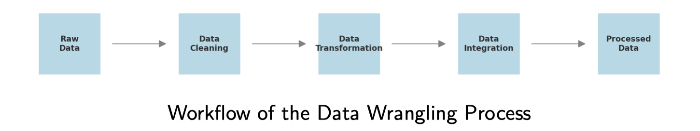

# lec02: Data Wrangling and Pre-processing

[toc]

## Data Wrangling and Pre-processing 

**Types of Data**

- Numerical
- Categorical

## Data Cleaning

### Missing Data

- **How to Identify:**
    - Visual inspection (e.g., heatmaps).
    - Programmatic methods: `isnull()` or `isna()` in Pandas.
- **How to Handle:**
    - **Remove** missing values (rows/columns).
    - **Impute** missing values (mean, median, or mode).
    - **Forward/backward fill**: use previous or next values to fill missing data.

### Handling Outlier

- **How to Identify**
    - Z-score
    - IQR (Interquartile Range).
- **Z-score**
    - Measures how far a data point is from the mean in terms of standard deviations.
    - Formula: $Z = (x-\mu) / \sigma$

- **Interquartile Range (IQR)**
    - Identifies outliers as data points outside **1.5 × IQR**. 
    - Formula: $IQR = Q3 − Q1$

- **How to handle**
    - **Remove**
    - **Cap**: Replace outliers with a threshold value (e.g., upper/lower bounds).
    - **Transform**: Apply log or square root transformations to reduce the impact of outliers.

### Handling Duplicates

- **How to identify**
- **How to handle**

## Data Transformation 

- **What is Data Transformation?**
    - The process of converting data into a suitable format for analysis or modeling.
- **Key Techniques:**
    - Feature scaling.
    - Encoding categorical data. 
    - Data binning.
    - Feature engineering. 
    - Handling imbalanced data.

### Feature Scaling

- **Common Methods**: ==归一化和标准化==
    - **Normalization** (**Min-Max** scaling). 
    - **Standardization** (**Z-score** scaling).
- **Normalization** (Min-Max scaling). 
    - Rescales data to a range of [0, 1]. 
    - Formula:  $X_{\text{norm}} = (X-X_{\min})/(X_{\max} - X_{\min}) $
    - Makes sense if min/max values have meaning in your data.
    - Sensitive to outliers.

- **Standardization** (Z-score scaling).
    - Rescales data to have **a mean of 0** and **a standard deviation of 1**. 
    - Formula: $X_{\text{std}} = (X-\mu) / \sigma$
    - **Generally most useful**, assumes data is more or less normally distributed.

### Encoding Categorical Data

- **Common Encoding Techniques:**
    - **One-hot encoding**:*Example: Red = [1, 0, 0], Green = [0, 1, 0], Blue = [0, 0, 1].*

    - **Label encoding**: *Example: Red = 0, Green = 1, Blue = 2.*

    - **Binary encoding**:*Example: Red = 00, Green = 01, Blue = 10.*

### Data Bining

- **What is Data Binning?**
    - **Converting continuous data into discrete categories (bins).**
- **Example (Age):**
    - 0-18 = ”Child”
    - 19-35 = ”Young Adult”
    - 36-60 = ”Adult”
    - 60+ = ”Senior”

### Feature engineering

- **What is Feature Engineering?**
    - The process of **creating new** features or modifying existing ones to improve model performance.
- **Techniques:**
    - Adding new features (e.g., calculating ratios or differences). 
    - Modifying features (e.g., log transformation).
    - Dropping irrelevant or redundant features.
- Example:
    - Creating a ”BMI” feature from height and weight.

### Handling Imbalanced Data

- **What is Imbalanced Data?**
    - When one class significantly outnumbers the other(s) in a classification problem.
- **Why is it a Problem?**
    - Models may become biased toward the majority class.
- **Techniques to Handle Imbalanced Data:**
    - **Resampling**: Oversampling the minority class or undersampling the majority class.
    - **Synthetic Data Generation**: Using techniques like SMOTE, GAN. 
    - **Algorithmic Approaches**: Using class-weighted models.

## Data Integration and Reduction 

- **What is Data Integration?**
    - The process of **combining data** from different sources into a **unified dataset**.
    - Ensures consistency and usability for analysis.
- **What is Data Reduction?**
    - The process of **reducing the size or complexity** of the dataset. 
    - Aims to retain important information while improving efficiency.
- **Key Techniques:**
    - Combining datasets (merging, concatenation, joining). 
    - Feature selection.
    - Dimensionality reduction (PCA, t-SNE, UMAP).

### Combining Datasets

- **Common Techniques**
    - **Merging**: Combines datasets based on common keys (e.g., primary keys in databases).
    - **Concatenation**: Stacks datasets either row-wise or column-wise. 
    - **Joining**: Combines datasets similar to SQL joins (e.g., inner, outer, left, right joins).

### Feature Selection

- **What is Feature Selection?**
    - The process of **selecting the most relevant features** for the analysis. 
    - Reduces dimensionality, improves interpretability, and enhances model performance.
- **Common Methods:**
    - **Correlation**: Identifies features highly correlated with the target variable.
    - **Variance Threshold**: Removes features with low variance.
    - **Feature Importance**: Uses algorithms like Random Forest to rank feature importance.

### Dimensionality Reduction

- **What is Dimensionality Reduction?**
    - Reducing the number of features while preserving important information.
- **Why is it Important?**
    - Reduces computational complexity.
    - Improves model performance by removing noise. 
    - Visualizes high-dimensional data.
- **Common Techniques:**
    - **PCA (Principal Component Analysis).**
        - Projects data onto a lower-dimensional space. 
        - Retains maximum variance.
    - **t-SNE (t-Distributed Stochastic Neighbor Embedding).** 
        - Non-linear dimensionality reduction technique. 
        - Focuses on preserving local relationships in data.
    - **UMAP (Uniform Manifold Approximation and Projection).**
        - Preserves local and global data structures. 
        - Suitable for clustering and visualization.

## The Complete ML Workflow

