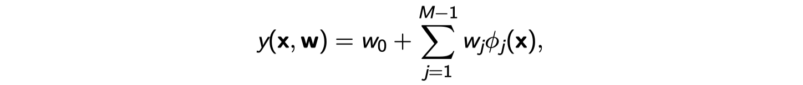
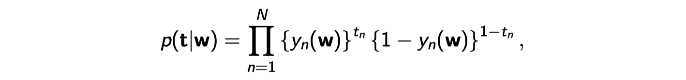

# lec06: Linear Regression and Logistic Regression

[toc]

## Linear Regression

- 最基础的线性回归

- 添加了Linear Basis Function $\phi(x)$

- Examples of Basis Functions

### Least Square

- Error计算，其中`t`是标签

> **Least Square 最小二乘法**
>
> 通过最小化误差平方和，我们可以得到回归模型的**最佳参数**

### Maximum Likelihood

- 假设label `t` 和目标变量`y`满足下面的关系，其中$\epsilon$是误差项

- 那么可以计算出下面的条件概率

- 那么likelihood function，即似然函数则可以用下面的公式表示

### Gradient Descent

- 接下来用梯度下降法，计算误差`E`对每一个权重`w_i`的偏导

- 让Gradient成0，我们有

### Regularized Least Squares

> 在没有正则化的情况下，模型会通过调整参数来尽可能地减少训练数据中的误差。然而，如果模型过于复杂，可能会出现**过拟合**（overfitting），即模型过于贴合训练数据，导致它对新数据的预测能力差。
>
> 正则化的作用就是通过在损失函数中加入**惩罚项**来抑制模型的复杂度，从而减少过拟合。这样，模型不仅会关注训练数据的拟合，还会限制模型参数的大小，使得它更加平滑，并能更好地泛化到未见过的数据。

- To **avoid over-fitting**, we consider adding a **regularization term** to an error function, so that the total error function to be minimized takes the form
    - λ is the regularization coefficient
    - `E_D` is the data-dependent error, and `E_W` is the regularization term:

- Gradient Descent

- Setting this gradient to zero gives

- A more general regularizer
    - **large λ**: restrict the model’s freedom for fitting data, leading to **high bias and low variance** 
    - **small λ**: warrant more freedom to fit data, resulting in **low bias and high variance**

- **`q=1`**: **L1-lasso regularizer**.
- **`q=2`: L2-ridge regularizer**
- **ElasticNet** 同时引入了L1和L2正则化

### The Bias-Variance Decomposition

> **偏差**（Bias）：模型预测值与真实值之间的差异，表示模型的系统性误差。
>
> **方差**（Variance）：模型预测值的波动性，表示模型对训练数据的敏感程度。
>
> **噪声**（Noise）：数据本身的随机误差，通常是无法控制的，来源于外部因素或测量误差

## Logistic Regression

### Binary Classification

- 对于二元分类，假设有两个类`{C1,C2}`

- 用linear basis function去尝试拟合`a`，即$a = w^T\phi(x)$

- 对于feature `X` 和label `t`，如下

- Cross-entropy error function

